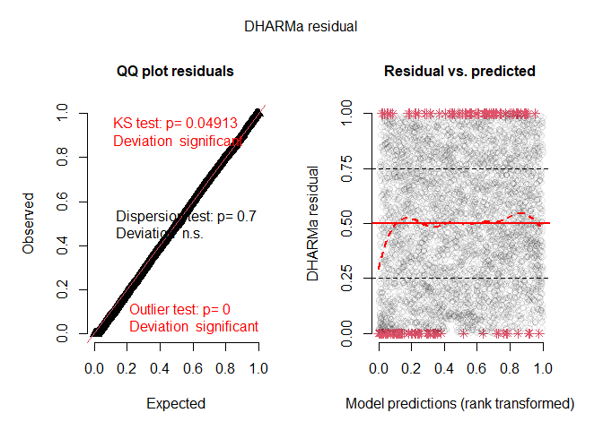

<!-- README.md is generated from README.Rmd. Please edit that file -->

# ewp

<!-- badges: start -->

[](https://github.com/pboesu/ewp/actions)
[](https://app.codecov.io/gh/pboesu/ewp?branch=main)
<!-- badges: end -->

The goal of ewp is to provide a modelling interface for underdispersed
count data based on the exponentially weighted Poisson (EWP)
distribution described by Ridout & Besbeas (2004), allowing for
nest-level covariates on the location parameter $\lambda$ of the EWP.
Currently only the three-parameter version of the distribution (EWP_3)
is implemented.

## Installation

You can install the development version of ewp directly from github like
so (requires a working C++ compiler toolchain):

``` r
remotes::install_github('pboesu/ewp')
```

## Example

The package contains a reconstructed version of the linnet dataset from
Ridout & Besbeas (2004), which consists of 5414 clutch size records and
is augmented with two synthetic covariates, one that is random noise,
and one that is correlated with clutch size. The parameter estimates for
the intercept-only model presented in Ridout & Besbeas (2004) can be
reproduced like so:

``` r
library(ewp)
fit_null <- ewp_reg(eggs ~ 1, data = linnet)# this may take a few seconds
#> start values are: 
#> (Intercept)       beta1       beta2 
#>    1.546823    0.000000    0.000000 
#>   Nelder-Mead direct search function minimizer
#> function value for initial parameters = 9530.456776
#>   Scaled convergence tolerance is 0.000142015
#> Stepsize computed as 0.154682
#> BUILD              4 9850.957618 9239.843356
#> LO-REDUCTION       6 9530.456776 9239.843356
#> EXTENSION          8 9345.645115 8884.694258
#> EXTENSION         10 9252.719245 8664.238446
#> EXTENSION         12 9239.843356 8289.696815
#> EXTENSION         14 8884.694258 7349.833240
#> LO-REDUCTION      16 8664.238446 7349.833240
#> EXTENSION         18 8289.696815 6914.320389
#> EXTENSION         20 7924.259090 5981.205486
#> LO-REDUCTION      22 7349.833240 5981.205486
#> LO-REDUCTION      24 6914.320389 5981.205486
#> EXTENSION         26 6687.103544 5444.678590
#> LO-REDUCTION      28 6423.388590 5444.678590
#> LO-REDUCTION      30 5981.205486 5444.678590
#> LO-REDUCTION      32 5622.219193 5444.678590
#> REFLECTION        34 5568.109852 5422.937160
#> HI-REDUCTION      36 5540.312583 5422.937160
#> LO-REDUCTION      38 5444.678590 5411.634237
#> REFLECTION        40 5438.767245 5395.497757
#> HI-REDUCTION      42 5422.937160 5394.597174
#> REFLECTION        44 5411.634237 5386.741470
#> HI-REDUCTION      46 5395.497757 5380.486713
#> REFLECTION        48 5394.597174 5377.083182
#> EXTENSION         50 5386.741470 5347.349006
#> HI-REDUCTION      52 5380.486713 5347.349006
#> LO-REDUCTION      54 5377.083182 5347.349006
#> REFLECTION        56 5369.223853 5343.264305
#> EXTENSION         58 5349.392539 5312.976657
#> LO-REDUCTION      60 5347.349006 5312.976657
#> LO-REDUCTION      62 5343.264305 5312.976657
#> REFLECTION        64 5329.488475 5311.428854
#> REFLECTION        66 5319.143285 5304.103315
#> LO-REDUCTION      68 5312.976657 5304.103315
#> LO-REDUCTION      70 5311.428854 5304.103315
#> REFLECTION        72 5307.430309 5302.277377
#> REFLECTION        74 5306.693914 5300.785404
#> HI-REDUCTION      76 5304.103315 5300.785404
#> LO-REDUCTION      78 5302.952584 5300.785404
#> REFLECTION        80 5302.277377 5300.290714
#> LO-REDUCTION      82 5300.846562 5299.952796
#> LO-REDUCTION      84 5300.785404 5299.952796
#> REFLECTION        86 5300.290714 5299.926735
#> LO-REDUCTION      88 5300.175930 5299.799059
#> REFLECTION        90 5299.952796 5299.427247
#> LO-REDUCTION      92 5299.926735 5299.427247
#> LO-REDUCTION      94 5299.799059 5299.427247
#> LO-REDUCTION      96 5299.618622 5299.427247
#> HI-REDUCTION      98 5299.517531 5299.427247
#> HI-REDUCTION     100 5299.453171 5299.418637
#> LO-REDUCTION     102 5299.439653 5299.414052
#> HI-REDUCTION     104 5299.427247 5299.408235
#> EXTENSION        106 5299.418637 5299.387332
#> LO-REDUCTION     108 5299.414052 5299.387332
#> LO-REDUCTION     110 5299.408235 5299.387332
#> REFLECTION       112 5299.395133 5299.380631
#> HI-REDUCTION     114 5299.391502 5299.380631
#> LO-REDUCTION     116 5299.387332 5299.379789
#> EXTENSION        118 5299.383611 5299.373900
#> LO-REDUCTION     120 5299.380631 5299.373900
#> REFLECTION       122 5299.379789 5299.369522
#> LO-REDUCTION     124 5299.374318 5299.369522
#> HI-REDUCTION     126 5299.373900 5299.369522
#> REFLECTION       128 5299.370488 5299.367818
#> LO-REDUCTION     130 5299.370428 5299.367818
#> LO-REDUCTION     132 5299.369522 5299.367690
#> EXTENSION        134 5299.367877 5299.364705
#> HI-REDUCTION     136 5299.367818 5299.364705
#> LO-REDUCTION     138 5299.367690 5299.364705
#> EXTENSION        140 5299.366530 5299.362703
#> REFLECTION       142 5299.364902 5299.362530
#> LO-REDUCTION     144 5299.364705 5299.362530
#> LO-REDUCTION     146 5299.363250 5299.362530
#> REFLECTION       148 5299.362712 5299.362270
#> LO-REDUCTION     150 5299.362703 5299.362270
#> REFLECTION       152 5299.362530 5299.362175
#> LO-REDUCTION     154 5299.362408 5299.362175
#> LO-REDUCTION     156 5299.362270 5299.362127
#> Exiting from Nelder Mead minimizer
#>     158 function evaluations used
#> 
#> Calculating Hessian. This may take a while.
summary(fit_null)
#> Deviance residuals:
#> 
#> lambda coefficients (ewp3 with log link):
#>             Estimate Std. Error z value Pr(>|z|)    
#> (Intercept) 1.584630   0.003511   451.3   <2e-16 ***
#> ---
#> Signif. codes:  0 '***' 0.001 '**' 0.01 '*' 0.05 '.' 0.1 ' ' 1
#> 
#> dispersion coefficients:
#>       Estimate Std. Error z value Pr(>|z|)    
#> beta1  1.46475    0.05589   26.21   <2e-16 ***
#> beta2  2.35687    0.05607   42.03   <2e-16 ***
#> ---
#> Signif. codes:  0 '***' 0.001 '**' 0.01 '*' 0.05 '.' 0.1 ' ' 1
#> 
#> Number of iterations in  optimization: 158 
#> Log-likelihood: -5299 on 3 Df
```

Note that the linear predictor on $\lambda$ uses a log-link.

A model with nest-level covariates can be fitted by specifying a more
complex model formula - as in the base R `glm()`

``` r
fit <- ewp_reg(eggs ~ cov1 + cov2, data = linnet)# this may take 5-10 seconds
#> start values are: 
#>  (Intercept)         cov1         cov2        beta1        beta2 
#>  1.204279467 -0.001259307  0.071872488  0.000000000  0.000000000 
#>   Nelder-Mead direct search function minimizer
#> function value for initial parameters = 9434.616375
#>   Scaled convergence tolerance is 0.000140587
#> Stepsize computed as 0.120428
#> BUILD              6 9626.628228 9119.643896
#> LO-REDUCTION       8 9451.025460 9119.643896
#> LO-REDUCTION      10 9434.616581 9119.643896
#> EXTENSION         12 9434.616375 8849.127111
#> EXTENSION         14 9276.068171 8697.296898
#> EXTENSION         16 9152.494809 8266.354295
#> LO-REDUCTION      18 9132.641835 8266.354295
#> EXTENSION         20 9119.643896 8030.045856
#> LO-REDUCTION      22 8849.127111 8030.045856
#> EXTENSION         24 8697.296898 7539.267942
#> EXTENSION         26 8342.653473 6870.531324
#> LO-REDUCTION      28 8293.583455 6870.531324
#> LO-REDUCTION      30 8266.354295 6870.531324
#> LO-REDUCTION      32 8030.045856 6870.531324
#> EXTENSION         34 7599.393662 5903.056971
#> LO-REDUCTION      36 7539.267942 5903.056971
#> LO-REDUCTION      38 7219.751742 5903.056971
#> LO-REDUCTION      40 7014.734687 5903.056971
#> LO-REDUCTION      42 6870.531324 5903.056971
#> LO-REDUCTION      44 6207.529527 5886.078259
#> LO-REDUCTION      46 6204.298406 5886.078259
#> EXTENSION         48 6117.761161 5672.261122
#> EXTENSION         50 5993.249608 5541.358953
#> LO-REDUCTION      52 5966.391856 5541.358953
#> LO-REDUCTION      54 5903.056971 5541.358953
#> LO-REDUCTION      56 5886.078259 5541.358953
#> REFLECTION        58 5672.261122 5508.450689
#> EXTENSION         60 5596.763627 5385.563669
#> LO-REDUCTION      62 5568.588072 5385.563669
#> HI-REDUCTION      64 5546.051825 5385.563669
#> EXTENSION         66 5541.358953 5303.381473
#> LO-REDUCTION      68 5508.450689 5303.381473
#> EXTENSION         70 5477.097437 5221.881195
#> LO-REDUCTION      72 5431.279117 5221.881195
#> LO-REDUCTION      74 5394.299116 5221.881195
#> LO-REDUCTION      76 5385.563669 5221.881195
#> REFLECTION        78 5303.381473 5205.661291
#> LO-REDUCTION      80 5287.570919 5193.085472
#> HI-REDUCTION      82 5255.449184 5193.085472
#> HI-REDUCTION      84 5252.024453 5193.085472
#> REFLECTION        86 5225.545464 5164.987435
#> HI-REDUCTION      88 5221.881195 5164.987435
#> LO-REDUCTION      90 5211.588135 5164.987435
#> LO-REDUCTION      92 5205.661291 5164.987435
#> LO-REDUCTION      94 5193.618010 5164.987435
#> LO-REDUCTION      96 5193.085472 5164.987435
#> EXTENSION         98 5182.189009 5128.451340
#> LO-REDUCTION     100 5177.988668 5128.451340
#> LO-REDUCTION     102 5177.625815 5128.451340
#> LO-REDUCTION     104 5167.629524 5128.451340
#> LO-REDUCTION     106 5164.987435 5128.451340
#> LO-REDUCTION     108 5162.634413 5128.451340
#> EXTENSION        110 5151.730881 5108.618833
#> LO-REDUCTION     112 5149.652399 5108.618833
#> LO-REDUCTION     114 5148.084525 5108.618833
#> EXTENSION        116 5131.502909 5070.248703
#> LO-REDUCTION     118 5128.451340 5070.248703
#> LO-REDUCTION     120 5112.262090 5070.248703
#> LO-REDUCTION     122 5111.720620 5070.248703
#> EXTENSION        124 5108.618833 5042.715837
#> LO-REDUCTION     126 5085.558460 5042.715837
#> EXTENSION        128 5083.615226 5021.628060
#> LO-REDUCTION     130 5074.004365 5021.628060
#> EXTENSION        132 5070.248703 5018.116733
#> REFLECTION       134 5045.448212 5006.813413
#> REFLECTION       136 5042.715837 5005.530210
#> REFLECTION       138 5026.541741 5002.519485
#> LO-REDUCTION     140 5021.628060 5002.519485
#> HI-REDUCTION     142 5018.116733 5002.519485
#> EXTENSION        144 5006.813413 4987.086604
#> LO-REDUCTION     146 5006.779353 4987.086604
#> LO-REDUCTION     148 5005.530210 4987.086604
#> EXTENSION        150 5004.086981 4982.477236
#> LO-REDUCTION     152 5002.519485 4982.477236
#> REFLECTION       154 4999.122804 4981.210903
#> LO-REDUCTION     156 4995.914150 4981.210903
#> LO-REDUCTION     158 4988.252237 4981.210903
#> EXTENSION        160 4987.086604 4974.458880
#> LO-REDUCTION     162 4982.477236 4974.458880
#> HI-REDUCTION     164 4982.113846 4974.458880
#> EXTENSION        166 4981.353837 4970.105655
#> EXTENSION        168 4981.210903 4962.017090
#> LO-REDUCTION     170 4978.784021 4962.017090
#> LO-REDUCTION     172 4975.958085 4962.017090
#> EXTENSION        174 4974.458880 4959.533990
#> EXTENSION        176 4970.105655 4951.552017
#> EXTENSION        178 4965.273945 4946.248602
#> REFLECTION       180 4964.802915 4945.757448
#> EXTENSION        182 4962.017090 4920.864237
#> LO-REDUCTION     184 4959.533990 4920.864237
#> LO-REDUCTION     186 4951.552017 4920.864237
#> LO-REDUCTION     188 4946.248602 4920.864237
#> LO-REDUCTION     190 4945.757448 4920.864237
#> LO-REDUCTION     192 4944.906249 4920.864237
#> EXTENSION        194 4938.117046 4895.324564
#> LO-REDUCTION     196 4933.035357 4895.324564
#> LO-REDUCTION     198 4928.768541 4895.324564
#> EXTENSION        200 4924.913374 4872.794678
#> EXTENSION        202 4920.864237 4847.892877
#> EXTENSION        204 4903.147032 4818.331147
#> LO-REDUCTION     206 4897.303476 4818.331147
#> EXTENSION        208 4895.324564 4780.142014
#> EXTENSION        210 4872.794678 4712.605206
#> LO-REDUCTION     212 4847.892877 4712.605206
#> LO-REDUCTION     214 4831.798213 4712.605206
#> EXTENSION        216 4818.331147 4660.911938
#> EXTENSION        218 4780.142014 4641.137648
#> REFLECTION       220 4719.194139 4619.932666
#> LO-REDUCTION     222 4717.233684 4619.932666
#> LO-REDUCTION     224 4712.605206 4619.187470
#> HI-REDUCTION     226 4660.911938 4619.187470
#> LO-REDUCTION     228 4649.349108 4619.187470
#> HI-REDUCTION     230 4643.564429 4619.187470
#> REFLECTION       232 4641.137648 4614.316361
#> REFLECTION       234 4629.431301 4609.955383
#> LO-REDUCTION     236 4625.902061 4609.955383
#> EXTENSION        238 4619.932666 4600.729452
#> EXTENSION        240 4619.187470 4585.518795
#> EXTENSION        242 4614.316361 4573.507442
#> LO-REDUCTION     244 4610.692942 4573.507442
#> LO-REDUCTION     246 4609.955383 4573.507442
#> EXTENSION        248 4600.729452 4526.011697
#> LO-REDUCTION     250 4586.421841 4526.011697
#> LO-REDUCTION     252 4585.518795 4526.011697
#> LO-REDUCTION     254 4575.651751 4526.011697
#> LO-REDUCTION     256 4573.507442 4526.011697
#> REFLECTION       258 4548.207618 4519.423923
#> LO-REDUCTION     260 4547.604486 4519.423923
#> EXTENSION        262 4540.125925 4506.182590
#> EXTENSION        264 4539.849575 4503.920482
#> REFLECTION       266 4528.131416 4492.610910
#> LO-REDUCTION     268 4526.011697 4492.610910
#> HI-REDUCTION     270 4519.423923 4492.610910
#> LO-REDUCTION     272 4508.426674 4492.610910
#> HI-REDUCTION     274 4506.182590 4492.610910
#> LO-REDUCTION     276 4504.480649 4492.610910
#> LO-REDUCTION     278 4503.920482 4492.610910
#> EXTENSION        280 4502.127632 4487.928063
#> EXTENSION        282 4498.880011 4485.722088
#> EXTENSION        284 4497.193839 4478.955715
#> EXTENSION        286 4492.684830 4469.552548
#> LO-REDUCTION     288 4492.610910 4469.552548
#> LO-REDUCTION     290 4487.928063 4469.552548
#> LO-REDUCTION     292 4485.722088 4469.552548
#> LO-REDUCTION     294 4478.955715 4469.552548
#> EXTENSION        296 4476.962033 4463.592074
#> LO-REDUCTION     298 4475.549973 4463.592074
#> EXTENSION        300 4474.057802 4457.130187
#> EXTENSION        302 4471.430412 4455.492333
#> LO-REDUCTION     304 4469.552548 4455.492333
#> REFLECTION       306 4464.993591 4451.316053
#> REFLECTION       308 4463.592074 4449.633668
#> REFLECTION       310 4457.497324 4446.800662
#> LO-REDUCTION     312 4457.130187 4446.800662
#> HI-REDUCTION     314 4455.492333 4446.800662
#> LO-REDUCTION     316 4451.316053 4446.800662
#> LO-REDUCTION     318 4451.099607 4446.800662
#> LO-REDUCTION     320 4449.633668 4446.800662
#> LO-REDUCTION     322 4449.018436 4446.800662
#> EXTENSION        324 4448.865854 4445.780545
#> EXTENSION        326 4447.605468 4444.723881
#> EXTENSION        328 4447.601948 4444.541308
#> LO-REDUCTION     330 4447.311780 4444.517844
#> REFLECTION       332 4446.800662 4443.666792
#> LO-REDUCTION     334 4445.780545 4443.567763
#> LO-REDUCTION     336 4444.723881 4443.567763
#> LO-REDUCTION     338 4444.541308 4443.567763
#> HI-REDUCTION     340 4444.517844 4443.567763
#> LO-REDUCTION     342 4443.769196 4443.529682
#> LO-REDUCTION     344 4443.703550 4443.440424
#> HI-REDUCTION     346 4443.678898 4443.440424
#> HI-REDUCTION     348 4443.666792 4443.440424
#> HI-REDUCTION     350 4443.567763 4443.440424
#> LO-REDUCTION     352 4443.529682 4443.434664
#> HI-REDUCTION     354 4443.495182 4443.434281
#> LO-REDUCTION     356 4443.468020 4443.410388
#> HI-REDUCTION     358 4443.453854 4443.410388
#> HI-REDUCTION     360 4443.440424 4443.410388
#> LO-REDUCTION     362 4443.434664 4443.408733
#> HI-REDUCTION     364 4443.434281 4443.408733
#> HI-REDUCTION     366 4443.417215 4443.408733
#> HI-REDUCTION     368 4443.414751 4443.405962
#> LO-REDUCTION     370 4443.410907 4443.405820
#> REFLECTION       372 4443.410388 4443.404643
#> HI-REDUCTION     374 4443.409324 4443.403071
#> HI-REDUCTION     376 4443.408733 4443.403071
#> LO-REDUCTION     378 4443.405962 4443.402867
#> LO-REDUCTION     380 4443.405820 4443.401836
#> HI-REDUCTION     382 4443.404643 4443.401836
#> HI-REDUCTION     384 4443.403989 4443.401836
#> HI-REDUCTION     386 4443.403071 4443.401836
#> REFLECTION       388 4443.402867 4443.401350
#> HI-REDUCTION     390 4443.402117 4443.401350
#> LO-REDUCTION     392 4443.402034 4443.401350
#> REFLECTION       394 4443.401923 4443.400796
#> LO-REDUCTION     396 4443.401836 4443.400796
#> LO-REDUCTION     398 4443.401509 4443.400780
#> LO-REDUCTION     400 4443.401380 4443.400766
#> REFLECTION       402 4443.401350 4443.400632
#> LO-REDUCTION     404 4443.401087 4443.400565
#> EXTENSION        406 4443.400796 4443.399920
#> LO-REDUCTION     408 4443.400780 4443.399920
#> EXTENSION        410 4443.400766 4443.399864
#> EXTENSION        412 4443.400632 4443.399369
#> LO-REDUCTION     414 4443.400565 4443.399369
#> EXTENSION        416 4443.400333 4443.397427
#> LO-REDUCTION     418 4443.399920 4443.397427
#> LO-REDUCTION     420 4443.399864 4443.397427
#> LO-REDUCTION     422 4443.399686 4443.397427
#> EXTENSION        424 4443.399369 4443.396211
#> EXTENSION        426 4443.398711 4443.395159
#> EXTENSION        428 4443.398248 4443.394003
#> LO-REDUCTION     430 4443.398189 4443.394003
#> EXTENSION        432 4443.397427 4443.388066
#> LO-REDUCTION     434 4443.396211 4443.388066
#> LO-REDUCTION     436 4443.395159 4443.388066
#> LO-REDUCTION     438 4443.394066 4443.388066
#> EXTENSION        440 4443.394003 4443.381551
#> EXTENSION        442 4443.390654 4443.375561
#> LO-REDUCTION     444 4443.389186 4443.375561
#> LO-REDUCTION     446 4443.388569 4443.375561
#> EXTENSION        448 4443.388066 4443.364001
#> EXTENSION        450 4443.381551 4443.352020
#> LO-REDUCTION     452 4443.377278 4443.352020
#> LO-REDUCTION     454 4443.375836 4443.352020
#> EXTENSION        456 4443.375561 4443.348904
#> EXTENSION        458 4443.364001 4443.324315
#> LO-REDUCTION     460 4443.354778 4443.324315
#> LO-REDUCTION     462 4443.354669 4443.324315
#> LO-REDUCTION     464 4443.352020 4443.324315
#> LO-REDUCTION     466 4443.348904 4443.324315
#> EXTENSION        468 4443.337868 4443.300973
#> LO-REDUCTION     470 4443.334915 4443.300973
#> LO-REDUCTION     472 4443.333553 4443.300973
#> EXTENSION        474 4443.330758 4443.287939
#> EXTENSION        476 4443.324315 4443.258781
#> EXTENSION        478 4443.307881 4443.225017
#> LO-REDUCTION     480 4443.303561 4443.225017
#> LO-REDUCTION     482 4443.300973 4443.225017
#> EXTENSION        484 4443.287939 4443.188522
#> EXTENSION        486 4443.258781 4443.169582
#> EXTENSION        488 4443.252573 4443.150771
#> EXTENSION        490 4443.240784 4443.066023
#> LO-REDUCTION     492 4443.225017 4443.066023
#> LO-REDUCTION     494 4443.188522 4443.066023
#> LO-REDUCTION     496 4443.169582 4443.066023
#> LO-REDUCTION     498 4443.150771 4443.066023
#> EXTENSION        500 4443.117940 4443.050424
#> Exiting from Nelder Mead minimizer
#>     502 function evaluations used
#> 
#> Calculating Hessian. This may take a while.
summary(fit)
#> model did not converge
```

Simulation based residual diagnostics are indirectly available through
the package [DHARMa](https://cran.r-project.org/package=DHARMa), by
using the `simulate.ewp` method:

``` r
library(DHARMa)
#> Warning: package 'DHARMa' was built under R version 4.3.2
#> This is DHARMa 0.4.6. For overview type '?DHARMa'. For recent changes, type news(package = 'DHARMa')
#simulate from fitted model
sims <- simulate(fit, nsim = 20)

#create a DHARMa abject
DH <- createDHARMa(simulatedResponse = as.matrix(sims),#simulated responses
                   observedResponse = linnet$eggs,#original response
                   fittedPredictedResponse = fit$fitted.values,#fitted values from ewp model
                   integerResponse = T)#tell DHARMa this is a discrete probability distribution

#plot diagnostics
plot(DH)
#> DHARMa:testOutliers with type = binomial may have inflated Type I error rates for integer-valued distributions. To get a more exact result, it is recommended to re-run testOutliers with type = 'bootstrap'. See ?testOutliers for details
```



:warning: **Note that the maximum likelihood optimisation procedure is
still experimental** :warning:

In particular:  
- At the moment **the likelihood evaluation is optimised for small
counts ($\lambda$ \<\< 20)**, this means the model is currently only
suitable for datasets with expected counts up to 20-25, depending on the
degree of underdispersion. A warning is issued if this criterion in not
met when using `ewp_reg()`, but other functions may fail silently. -
Estimates may not be stable for models with many covariates and/or very
large sample sizes (1000s). **Centering and scaling continuous
covariates seems to help on that front.**

:warning::warning::warning:
